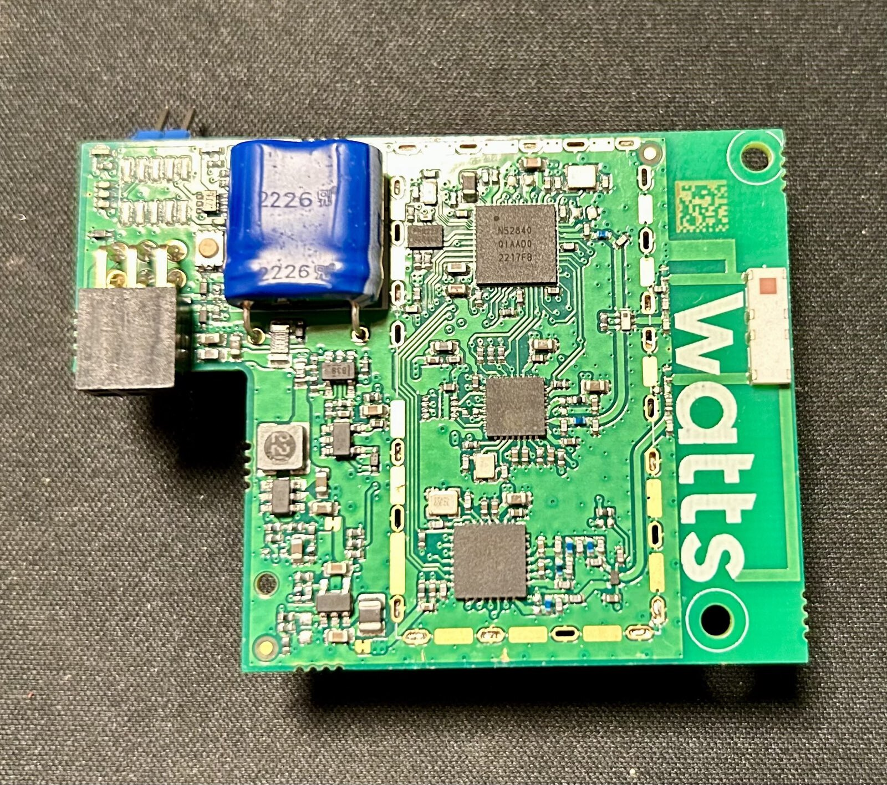
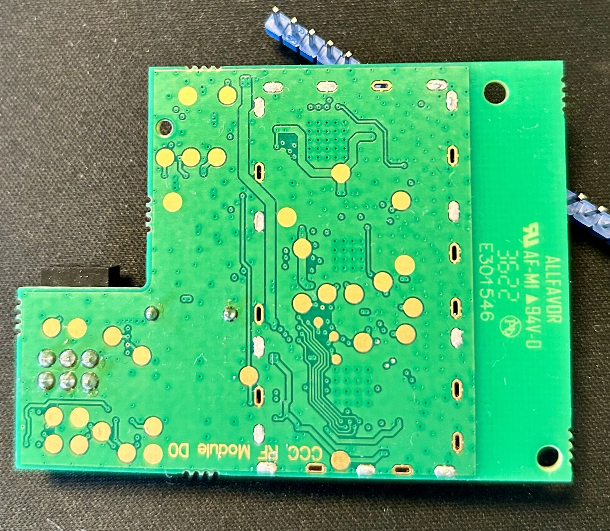
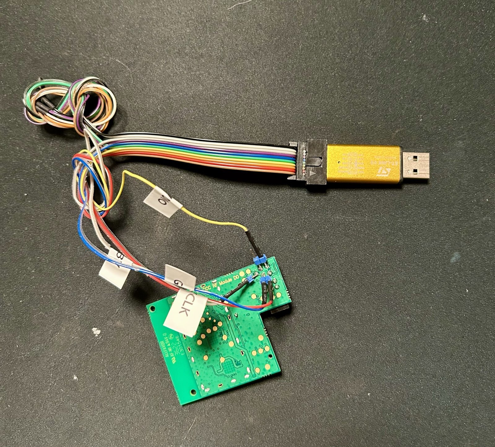

# watts-han-interface-card
A flash dump of the Watts Live Kamstrup HAN interface card 

Noteable tasks:
1. Clock
2. GPIO_0
3. GPIO_1

Misc:
1. Main micro controller is [NRF52840](https://www.nordicsemi.com/Products/nRF52840)
2. Has both bluetooth, LoRa and Wifi chips 
3. File system is LittleFS
4. Written using the Zephyr RTOS
5. Contains two full but different firmware version (one current and one failsafe)
6. Has HTTPS and MQTT modules for connection to the outside world
7. Uses AWS 

[Information on how to dump.](https://github.com/seemoo-lab/openhaystack/wiki/Flashing-nRF-with-OpenOCD---ST-Link)

[More information and where to buy.](https://shop.watts.dk/products/watts-live-kamstrup)

